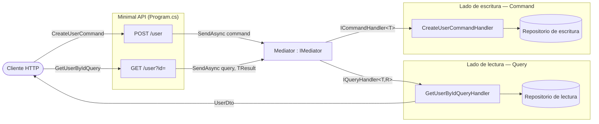
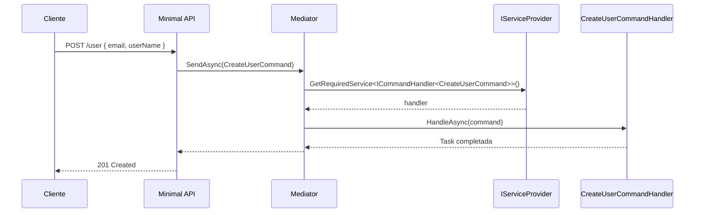
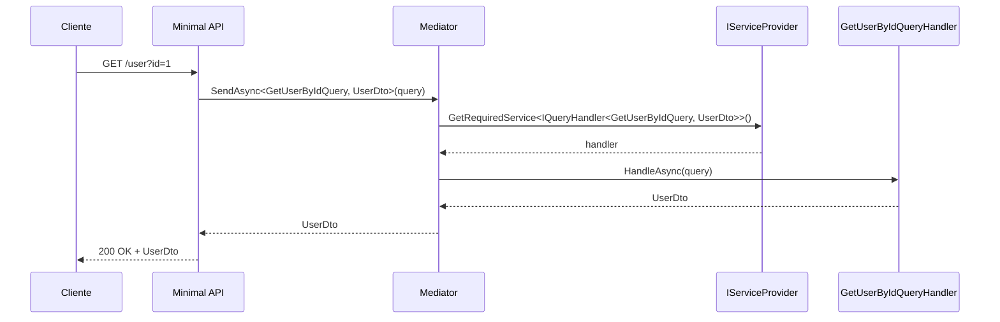

# CQRS.NoLibrary

Implementación del patrón **CQRS** (Command Query Responsibility Segregation) en una Minimal API de ASP.NET Core **sin librerías externas** (sin MediatR). El mediador, las abstracciones de comandos/consultas y sus handlers se escriben a mano y se resuelven mediante el contenedor de inyección de dependencias.

## Requisitos

- [.NET SDK 10.0](https://dotnet.microsoft.com/download/dotnet/10.0)

## Ejecutar

```bash
dotnet run
```

La API queda expuesta en `http://localhost:5023` (perfil `http`) o `https://localhost:7249` (perfil `https`).
En entorno `Development` el documento OpenAPI se publica en `/openapi/v1.json`.

## Endpoints

| Método | Ruta             | Descripción              | Cuerpo / Parámetros                          |
|--------|------------------|--------------------------|---------------------------------------------|
| POST   | `/user`          | Crea un usuario (command) | `{ "email": "...", "userName": "..." }`     |
| GET    | `/user?id={id}`  | Obtiene un usuario (query) | `id` en query string                       |

Hay ejemplos listos para usar en [`CQRS.NoLibrary.http`](CQRS.NoLibrary.http).

## Cómo funciona

Los **comandos** (escrituras) y las **consultas** (lecturas) viajan por caminos separados. El `Mediator` recibe el mensaje, localiza el handler correspondiente en el `IServiceProvider` y delega en él.



### Flujo de un comando



### Flujo de una consulta



## Estructura del proyecto

```
CQRS.NoLibrary/
├── Program.cs                     # Composición: registro de handlers y endpoints
├── Abstractions/
│   ├── ICommand.cs                # ICommand + ICommandHandler<TCommand>
│   ├── IQuery.cs                  # IQuery<TResult> + IQueryHandler<TQuery, TResult>
│   └── IMediator.cs               # IMediator + implementación Mediator
└── Features/
    └── Users/
        ├── CreateUserCommand.cs        # record : ICommand
        ├── CreateUserCommandHandler.cs # ICommandHandler<CreateUserCommand>
        ├── GetUserByIdQueryHandler.cs  # GetUserByIdQuery + su handler
        └── UserDto.cs                  # Modelo de lectura
```

## Añadir un nuevo caso de uso

1. Crea el mensaje como `record` que implemente `ICommand` o `IQuery<TResult>`.
2. Crea su handler implementando `ICommandHandler<T>` o `IQueryHandler<T, TResult>`.
3. Regístralo en [`Program.cs`](Program.cs):

   ```csharp
   builder.Services.AddScoped<ICommandHandler<MiComando>, MiComandoHandler>();
   ```

4. Expón el endpoint y envía el mensaje con `IMediator.SendAsync(...)`.
